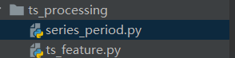

# Anomaly_Detection
主要是一些异常检测的代码  
  
cluster_data 是工况聚类的代码  

  
series_period 是判断信号周期性与周期提取的代码  
ts_feature 是信号特征提取的代码    
visuailization_eda 是最后异常检测的结果【点异常+模式异常】  
主要相关文档可以参考：https://www.yuque.com/xieburou-0qssx/wlvf1r/mgxteh  
